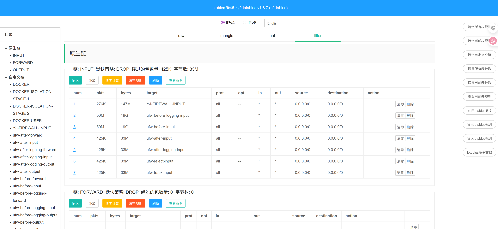

# iptables-web iptables管理系统
[](https://opensource.org/licenses/Apache-2.0) [](https://github.com/pretty66/iptables-web/blob/master/go.mod)
### iptables-web是一个轻量级的iptables web管理界面程序，支持二进制文件直接运行及docker快速部署安装；整个程序打包完成后只有一个二进制文件，适合日常运维使用。


## 目录
- [安装](#安装)
- [License](#License)

## 安装
### docker部署安装（推荐）
以docker形式部署注意要加两个参数`--privileged=true`，`--net=host`以特权模式运行，可以管理宿主机iptables规则
```shell
docker run -d \
  --name iptables-web \
  --privileged=true \
  --net=host \
  -e "IPT_WEB_USERNAME=admin" \
  -e "IPT_WEB_PASSWORD=admin" \
  -e "IPT_WEB_ADDRESS=:10001" \
  -p 10001:10001 \
  pretty66/iptables-web:1.1.1 
```
- `IPT_WEB_USERNAME`: 网页认证用户名，默认：admin
- `IPT_WEB_PASSWORD`: 网页认证密码，默认：admin
- `IPT_WEB_ADDRESS`: 程序监听地址地址，默认：10001

### 直接安装
```shell
git clone github.com/pretty66/iptables-web
cd iptables-web
make
# 直接运行
./iptables-server -a :10001 -u admin -p admin
# 后台运行
nohup ./iptables-server -a :10001 -u admin -p admin > /dev/null 2>&1 &
```

### License

iptables-web is under the Apache 2.0 license. See the [LICENSE](./LICENSE) directory for details.
